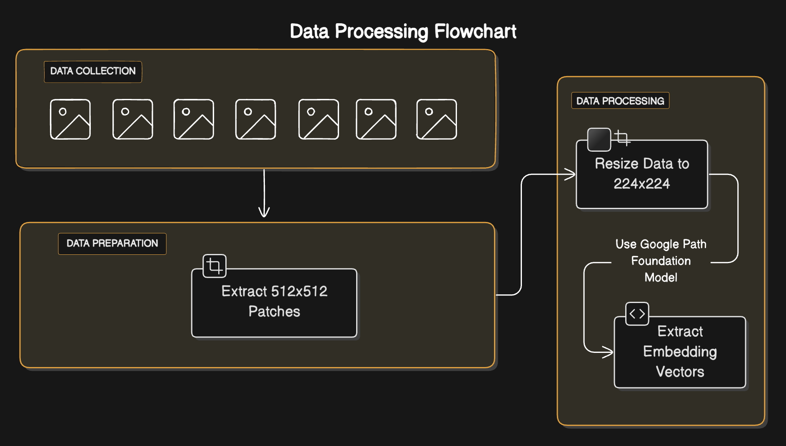

# Domain Specific Synthetic Image Generation

Bu proje, sentetik histopatoloji görüntüleri üretmek için çeşitli derin öğrenme tekniklerini kullanır. Çalışmada, Autoencoders, GAN'ler ve difüzyon modelleri gibi yaklaşımlar denenmiştir. Ayrıca, Google'ın yayınladığı Path Foundation modeli ile görüntü embedleri elde edilmiştir.

## 📂 İçindekiler
- [Veri Hazırlama](#veri-hazırlama)
- [Model Mimarileri](#model-mimarileri)
- [Eğitim Süreci](#eğitim-süreci)
- [Sonuçlar ve Değerlendirme](#sonuçlar-ve-değerlendirme)
- [Kurulum ve Kullanım](#kurulum-ve-kullanım)
- [Referanslar](#referanslar)

---

## 📊 Veri Hazırlama
Bu çalışmada kullanılan histopatoloji görüntüleri çeşitli veri kaynaklarından elde edilmiştir. Veri ön işleme aşamaları şunlardır:

1. **Görüntü Toplama:** Histopatoloji görüntülerinin toplanması ve organizasyonu.

    **Veri Seti:** Bu aşama [CAMELYON16](http://gigadb.org/dataset/100439) , [CANCER IMAGING ARCHIVE-KIDNEY](https://faspex.cancerimagingarchive.net/aspera/faspex/public/package?context=eyJyZXNvdXJjZSI6InBhY2thZ2VzIiwidHlwZSI6ImV4dGVybmFsX2Rvd25sb2FkX3BhY2thZ2UiLCJpZCI6IjU4NCIsInBhc3Njb2RlIjoiMTczZGYwYjBmMTI1Y2IxOTY0MmU2NmIyOGIzYzdlMjkwMmJjNWU1MiIsInBhY2thZ2VfaWQiOiI1ODQiLCJlbWFpbCI6ImhlbHBAY2FuY2VyaW1hZ2luZ2FyY2hpdmUubmV0In0=&redirected=true), [CANCER IMAGING ARCHIVE-COLON](https://faspex.cancerimagingarchive.net/aspera/faspex/public/package?context=eyJyZXNvdXJjZSI6InBhY2thZ2VzIiwidHlwZSI6ImV4dGVybmFsX2Rvd25sb2FkX3BhY2thZ2UiLCJpZCI6Ijk0OSIsInBhc3Njb2RlIjoiMjFiNmU2ZjIzNDQ2ODhlYTk1YmE1ZjFjOTUzYTNjZDA5ZWY0M2IwYSIsInBhY2thZ2VfaWQiOiI5NDkiLCJlbWFpbCI6ImhlbHBAY2FuY2VyaW1hZ2luZ2FyY2hpdmUubmV0In0=&redirected=true), [CANCER IMAGING ARCHIVE-LUNG](https://faspex.cancerimagingarchive.net/aspera/faspex/public/package?context=eyJyZXNvdXJjZSI6InBhY2thZ2VzIiwidHlwZSI6ImV4dGVybmFsX2Rvd25sb2FkX3BhY2thZ2UiLCJpZCI6IjU4NSIsInBhc3Njb2RlIjoiZmU1OTQyNTAwMjdjMGU0NDA4MmJkMjY5OTE4MjE4MTJjNzJmNGViYiIsInBhY2thZ2VfaWQiOiI1ODUiLCJlbWFpbCI6ImhlbHBAY2FuY2VyaW1hZ2luZ2FyY2hpdmUubmV0In0=&redirected=true) veri setlerinden alınan bir grup histopatoloji görüntüsünün tüm slayt görüntülerinin toplanmasını içerir.
    Bu kaynaklardan toplanan tüm slayt görüntülerinin listesi, aşağıdaki tabloda verilmiştir.

    | CAMELYON16 | CANCER IMAGING ARCHIVE-KIDNEY | CANCER IMAGING ARCHIVE-COLON | CANCER IMAGING ARCHIVE-LUNG |
    |------------|-------------------------------|------------------------------|-----------------------------|
    | `test_001.tif` | `C3L-00004-21.svs` |  `MSB-00241-01-05.svs` | `C3L-00001-21.svs` |
    | `test_002.tif` | `C3L-00004-26.svs` |  `MSB-00241-01-06.svs` | `C3L-00001-26.svs` |
    | `test_003.tif` | `C3L-00010-21.svs` |  `MSB-00352-03-05.svs` | `C3L-00009-21.svs` |
    | `test_004.tif` | `C3L-00010-26.svs` |  `MSB-00352-03-10.svs` | `C3L-00009-26.svs` |
    | `test_005.tif` | `C3L-00011-21.svs` |  `MSB-00352-05-02.svs` | `C3L-00080-21.svs` |
    | `test_006.tif` | `C3L-00011-26.svs` |  `MSB-00643-03-06.svs` | `C3L-00080-26.svs` |
    | `test_007.tif` | `C3L-00026-21.svs` |  `MSB-00643-03-11.svs` | `C3L-00083-21.svs` |
    | `test_008.tif` | `C3L-00026-26.svs` |  `MSB-00643-03-12.svs` | `C3L-00083-26.svs` |
    | `test_009.tif` | `C3L-00079-21.svs` |  `MSB-00643-03-13.svs` | `C3L-00093-21.svs` |
    | `test_010.tif` | `C3L-00079-26.svs` |  `MSB-00952-01-02.svs` | `C3L-00093-26.svs` |


2. **Yama Oluşturma:** Bu aşamada, histopatoloji görüntülerinden yamalar oluşturulmuştur. Her bir yama, 512x512 piksel boyutunda elde edilmiştir. Ardından yamalardan, embedding vektörleri elde etmek için 224x224 piksel boyutuna yeniden boyutlandırılmıştır.

3. **Embedding Elde Etme:** Bu aşamada, [Google Path Foundation](https://huggingface.co/google/path-foundation) modeli kullanılarak histopatoloji görüntülerinden embedding vektörleri elde edilmiştir. Bu vektörler, görüntülerin özet temsillerini içerir.

[Elde edilen verisetine huggingface ile erişmek için bu bağlantıyı kullanabilirsiniz.](https://huggingface.co/datasets/Cilem/mixed-histopathology-512)



---

## 🏗 Model Mimarileri
Projede kullanılan model yaklaşımları şunlardır:

### 1️⃣ Autoencoders
Autoencoders ile düşük boyutlu bir kodlama alanında görüntü temsili öğrenilmiştir. Kullanılan temel bileşenler:
- Encoder: Konvolüsyonel katmanlar ile veri sıkıştırma.
- Latent Space: Görüntünün özet bilgilerini içeren vektör temsili.
- Decoder: Sıkıştırılmış veriden orijinal görüntüyü yeniden üretme.

### 2️⃣ Generative Adversarial Networks (GANs)
GAN'ler, sentetik histopatoloji görüntüleri üretmek için kullanıldı. Kullanılan bileşenler:
- **Generator**: Rastgele gürültü vektörlerinden gerçekçi görüntüler üretir.
- **Discriminator**: Gerçek ve üretilmiş görüntüler arasındaki farkı ayırt etmeye çalışır.
- **Loss Function**: Minimax kayıp fonksiyonu kullanılarak model eğitildi.

### 3️⃣ Difüzyon Modelleri
Difüzyon modelleri ile daha yüksek kaliteli ve detaylı görüntüler üretmek amaçlanmıştır.
- Gaussian Noise eklenerek eğitim süreci başlatılmıştır.
- Aşamalı olarak gürültü azaltılarak gerçekçi görüntü üretilmiştir.


```bash
pip install -r requirements.txt
````

```bash
pip install -e .
```