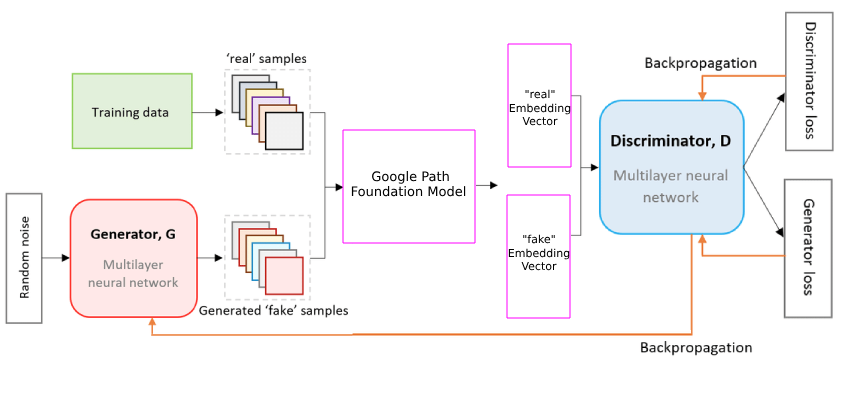
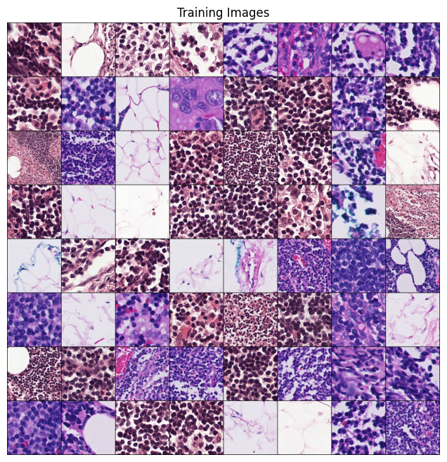
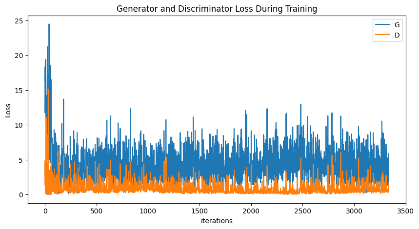
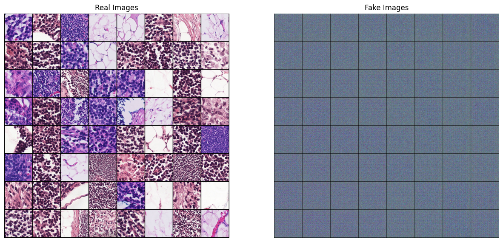

# TR
# Klasik DCGAN ve Manipüle Edilmiş GAN ile Sentetik Veri Üretimi

## 1. Proje Tanımı ve Amaçlar
Bu proje, Google Path Foundation modelini kullanarak histopatoloji görüntülerinden anlamlı embedding vektörleri üretmeyi ve bu vektörlerle sentetik veri üretimini amaçlamaktadır. İki ana çalışma gerçekleştirilmiştir:

1. **DCGAN ile Veri Üretimi**: Klasik bir GAN mimarisi kullanılarak 224x224 boyutunda histopatoloji görüntüleri üretilmiştir.

2. **GANwithEmbeddings**: Google Path Foundation modeli kullanılarak 1x384 boyutunda embedding vektörleri üretilmiş ve bu vektörlerle bir GAN modeli eğitilmiştir.

## 2. Metodoloji

### 2.1 Veri Seti
- **Kaynak**: [CAMELYON16](http://gigadb.org/dataset/100439) veri seti içerisinden histopatoloji görüntüleri kullanılmıştır. Bu veriler 224x224, 512x512, ve 1024x1024 boyutlarında patchler halinde hazırlanmıştır.
- **Görsellerin Boyutu**: 224x224 -> 224x224 yeniden boyutlandırma, 512x512 -> 224x224 yeniden boyutlandırma, 1024x1024 -> 224x224 yeniden boyutlandırma.

- **Veri Dönüşümleri**:
  - `Resize(size=224)`
  - `ToTensor()`
  - `Normalize(mean=(0.5, 0.5, 0.5), std=(0.5, 0.5, 0.5))`

### 2.2 Hiperparametreler
| Parametre                 | DCGAN Değeri | Embedding ile GAN Değeri |
|---------------------------|--------------|-----------------------|
| Batch Boyutu              | 128          | 128                   |
| Görüntü Boyutu            | 224          | 224                   |
| Kanal Sayısı              | 3            | 3                     |
| Latent Vektör Boyutu      | 100          | 100                   |
| Epoch Sayısı              | 10           | 10                    |
| Öğrenme Hızı              | 0.0002       | 0.0002                |
| Beta1                     | 0.5          | 0.5                   |

## 3. Model Mimarileri ve Eğitim Süreci

### 3.1 DCGAN Modeli
**Generator**: Birden fazla `ConvTranspose2d`, `BatchNorm2d`, ve `ReLU` katmanı içeren yapılar. Çıkış katmanı `Tanh` aktivasyon fonksiyonu içerir.

**Discriminator**: Birden fazla `Conv2d`, `BatchNorm2d`, ve `LeakyReLU` katmanı içerir. Çıkış katmanı `Sigmoid` aktivasyon fonksiyonu ile sonuç verir.

### 3.2 Embedding GAN Modeli
**Generator**: DCGAN modeliyle aynı mimariye sahiptir.

**Discriminator**: Google Path Foundation modelinden üretilen embedding vektörlerini giriş olarak alır ve doğrusal katmanlar (`Linear`) ile bir sınıflandırıcı olarak çalışır.

<table>
    <tr style="vertical-align: top">
        <th>DCGAN - Generator</th>
        <th>DCGAN - Discriminator</th>
        <th>Embedding ile GAN - Generator</th>
        <th>Embedding ile GAN - Discriminator</th>
    </tr>
    <tr style="vertical-align: top">
        <td></td>
        <td></td>
        <td></td>
        <td></td>
    </tr>
</table>

## 4. Sonuçlar ve Gözlemler

### 4.1 Kayıp Fonksiyonu İlerlemesi
Eğitim süresince kaydedilen `Loss_D` ve `Loss_G` değerleri aşağıda grafiklerle sunulacaktır:

- DCGAN için kayıp fonksiyonlarının grafiği.

- Embedding GAN için kayıp fonksiyonlarının grafiği.

## 5. Sonuç ve Gelecek Çalışmalar
- DCGAN modeli ile üretilen patoloji görüntüleri:

- Embedding GAN modeli ile üretilen patoloji görüntüleri:

- **Gelecek Çalışmalar**:
  - Gelişmiş Generator ve Discriminator modelleri geliştirilebilir.

---
# EN
# Synthetic Data Generation with Classic DCGAN and Modified GAN

## 1. Project Description and Objectives
This project aims to generate meaningful embedding vectors from histopathology images using the Google Path Foundation model and to generate synthetic data with these vectors. Two main studies have been conducted:

1. **Data Generation with DCGAN**: Histopathology images of size 224x224 were generated using a classic GAN architecture.

2. **GANwithEmbeddings**: Embedding vectors of size 1x384 were generated using the Google Path Foundation model and a GAN model was trained with these vectors.

## 2. Methodology

### 2.1 Data Set

- **Source**: Histopathology images from the [CAMELYON16](http://gigadb.org/dataset/100439) data set were used. These data are prepared in patches of size 224x224, 512x512, and 1024x1024.

- **Image Size**: 224x224 -> 224x224 resizing, 512x512 -> 224x224 resizing, 1024x1024 -> 224x224 resizing.

- **Data Transformations**:
  - `Resize(size=224)`
  - `ToTensor()`
  - `Normalize(mean=(0.5, 0.5, 0.5), std=(0.5, 0.5, 0.5))`

### 2.2 Hyperparameters

| Parameter                 | DCGAN Value | Value with Embeddings |
|---------------------------|-------------|-----------------------|
| Batch Size                | 128         | 128                   |
| Image Size                | 224         | 224                   |
| Number of Channels        | 3           | 3                     |
| Latent Vector Size        | 100         | 100                   |
| Number of Epochs          | 10          | 10                    |
| Learning Rate             | 0.0002      | 0.0002                |
| Beta1                     | 0.5         | 0.5                   |

## 3. Model Architectures and Training Process

### 3.1 DCGAN Model
**Generator**: Structures containing multiple `ConvTranspose2d`, `BatchNorm2d`, and `ReLU` layers. The output layer contains the `Tanh` activation function.

**Discriminator**: Contains multiple `Conv2d`, `BatchNorm2d`, and `LeakyReLU` layers. The output layer gives the result with the `Sigmoid` activation function.

### 3.2 Embedding GAN Model
**Generator**: Has the same architecture as the DCGAN model.

**Discriminator**: Takes the embedding vectors generated from the Google Path Foundation model as input and works as a classifier with linear layers (`Linear`).

<table>
    <tr style="vertical-align: top">
        <th>DCGAN - Generator</th>
        <th>DCGAN - Discriminator</th>
        <th>GAN with Embedding - Generator</th>
        <th>GAN with Embedding - Discriminator</th>
    </tr>
    <tr style="vertical-align: top">
        <td></td>
        <td></td>
        <td></td>
        <td></td>
    </tr>
</table>

## 4. Results and Observations

### 4.1 Progress of Loss Functions

The `Loss_D` and `Loss_G` values recorded during training will be presented in the graphs below:

- Graph of loss functions for DCGAN.

- Graph of loss functions for Embedding GAN.

## 5. Conclusion and Future Studies

- Pathology images generated with the DCGAN model:

- Pathology images generated with the Embedding GAN model:

- **Future Studies**:
  - Advanced Generator and Discriminator models can be developed.

